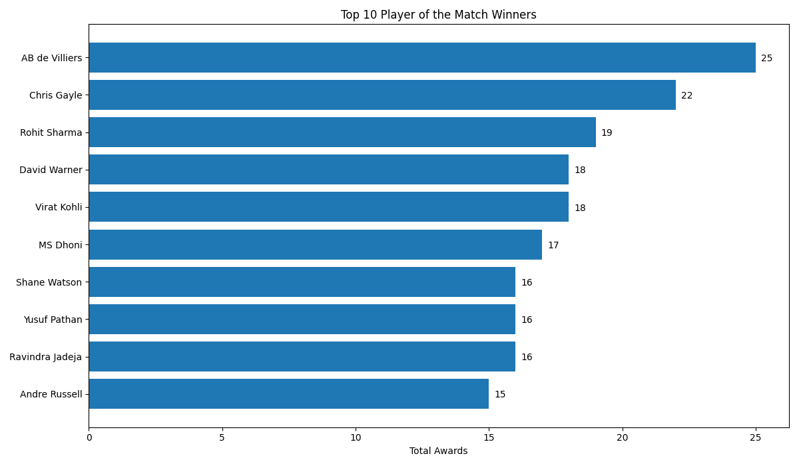
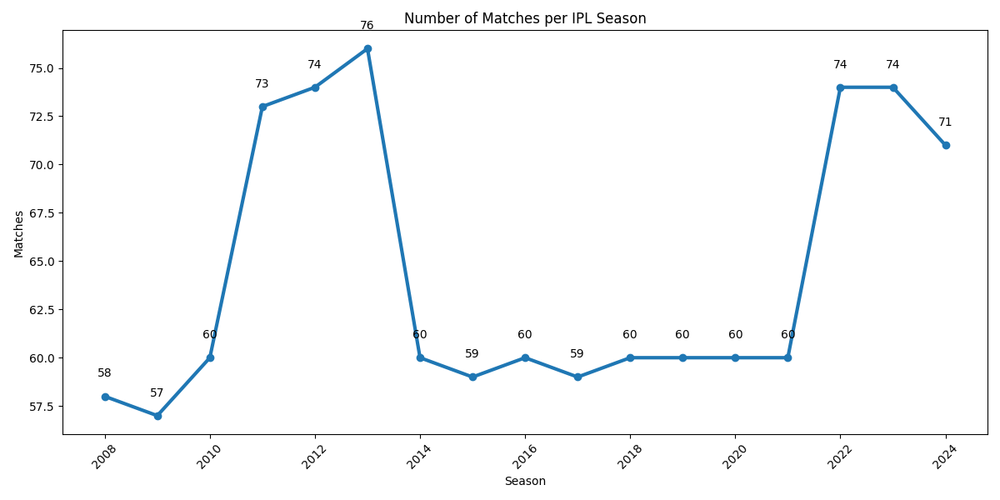
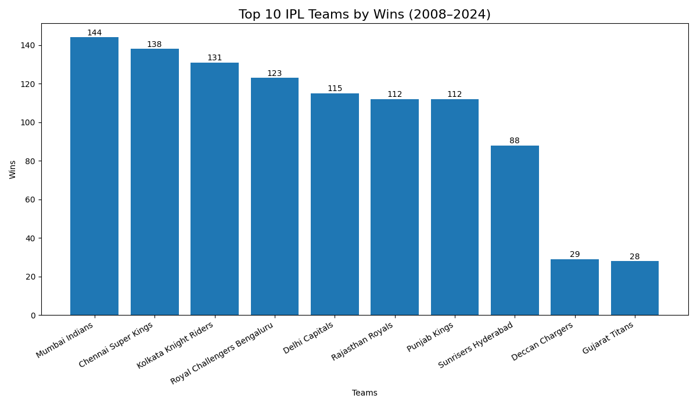
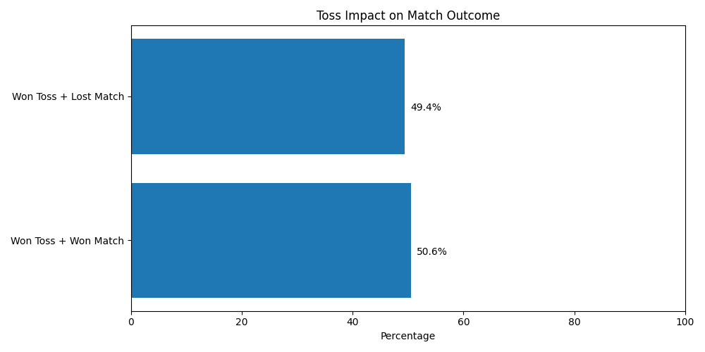

# 🏏 IPL Analytics Dashboard

Interactive Cricket Intelligence Platform built using Streamlit, Python, Pandas, and Plotly.

A modern analytics dashboard designed to explore IPL match performance, trends, and insights across seasons through interactive visualizations and data storytelling.

Designed to make cricket analytics simple, visual, and interactive.

---

## 🚀 Live Demo

View the deployed application:

https://ipl-analytics-dashboard-iemu7xm3qknpjk45z23mtu.streamlit.app/#ipl-analytics-dashboard

---

## 📌 Project Overview

IPL Analytics Dashboard helps users explore Indian Premier League data through interactive visualizations and performance insights.

Users can:

* Explore season-wise IPL performance
* Analyze top teams and players
* Understand toss impact
* Track match trends across seasons
* Filter and interact with dashboard components

---

## ✨ Features

### 📊 Interactive Analytics

* Season-wise filtering
* Dynamic KPI cards
* Interactive charts
* Real-time visual exploration

### 🏆 Team Insights

* Top winning teams analysis
* Team performance comparison

### 👑 Player Analytics

* Player of Match analysis
* Player performance insights

### 🎯 Match Intelligence

* Toss impact analysis
* Match trends visualization
* Season growth analytics

### 🎨 Modern Dashboard Experience

* Dark theme UI
* Responsive layout
* Portfolio-ready architecture

---

## 🧠 KPI Metrics Included

| Metric        | Description                       |
| ------------- | --------------------------------- |
| Total Matches | Total matches for selected season |
| Total Seasons | Available seasons                 |
| Top Team      | Highest performing team           |
| Top Player    | Most Player of Match awards       |

---

## 📈 Analytics Modules

### Top Teams

Visual comparison of winning teams.

### Top Players

Player performance exploration.

### Toss Impact

Analyze toss influence on outcomes.

### Match Trends

Season growth and historical trends.

---

:::writing{variant="standard" id="21483"}
## 📸 Dashboard Preview

### Dashboard Overview



---

### Season Insights



---

### Team Analytics



---

### Toss Analysis


:::

Bas.

GitHub automatically `Assets/...png` render kar dega.

Then:

```bash
git add README.md
git commit -m "Add dashboard screenshots"
git push

---

## 🗂 Dataset

### Raw Data

* matches 2008–2024.csv
* deliveries 2008–2024.csv

### Processed Data

* matches_clean.csv
* team_wins.csv

Includes:

* Season
* Teams
* Venue
* Winner
* Player of Match
* Toss Information
* Match Statistics

---

## 🛠 Tech Stack

### Frontend

* Streamlit

### Backend

* Python

### Data Processing

* Pandas
* NumPy

### Visualization

* Plotly
* Matplotlib

### Development

* Git
* GitHub

---

## 📂 Project Structure

```plaintext
IPL Analytics Dashboard
│
├── Dashboard/
│   └── app.py
│
├── Data/
│   ├── Raw/
│   └── Processed/
│
├── src/
│   └── ipl_dashboard/
│
├── Assets/
├── requirements.txt
└── README.md
```

---

## ⚙️ Run Locally

Clone:

```bash
git clone https://github.com/zavil-huda/ipl-analytics-dashboard.git
```

Move into project:

```bash
cd IPL-Analytics-Dashboard
```

Install:

```bash
pip install -r requirements.txt
```

Run:

```bash
streamlit run Dashboard/app.py
```

---

## 🔮 Future Improvements

* Player Search
* Team Comparison
* Venue Analytics
* Export Charts
* Mobile Optimization
* Advanced Insights
* AI-powered Predictions

---

## 👨‍💻 Author

Built & Designed by **Zavil Huda Quraishi**

Data • Design • Intelligence

---

## ⭐ Support

If you found this project useful:

⭐ Star the repository
📢 Share feedback
🚀 Explore the dashboard
